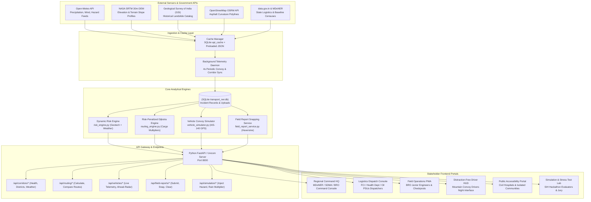
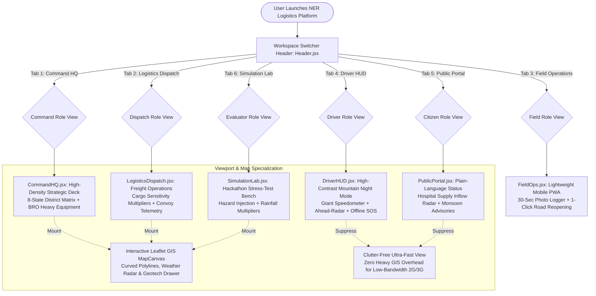
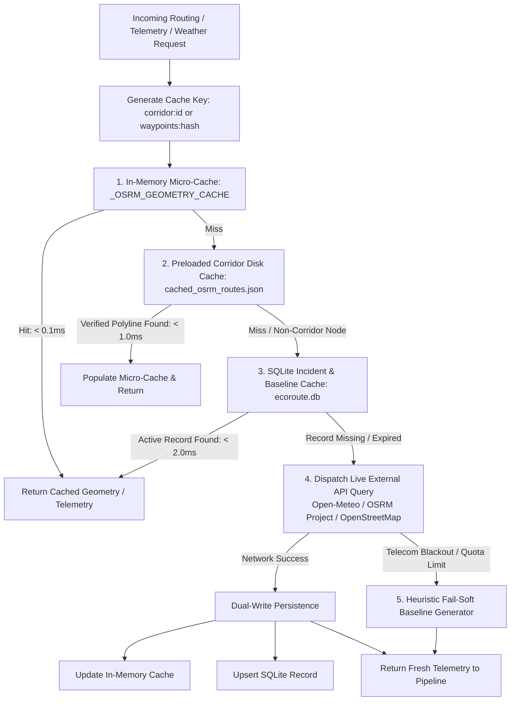
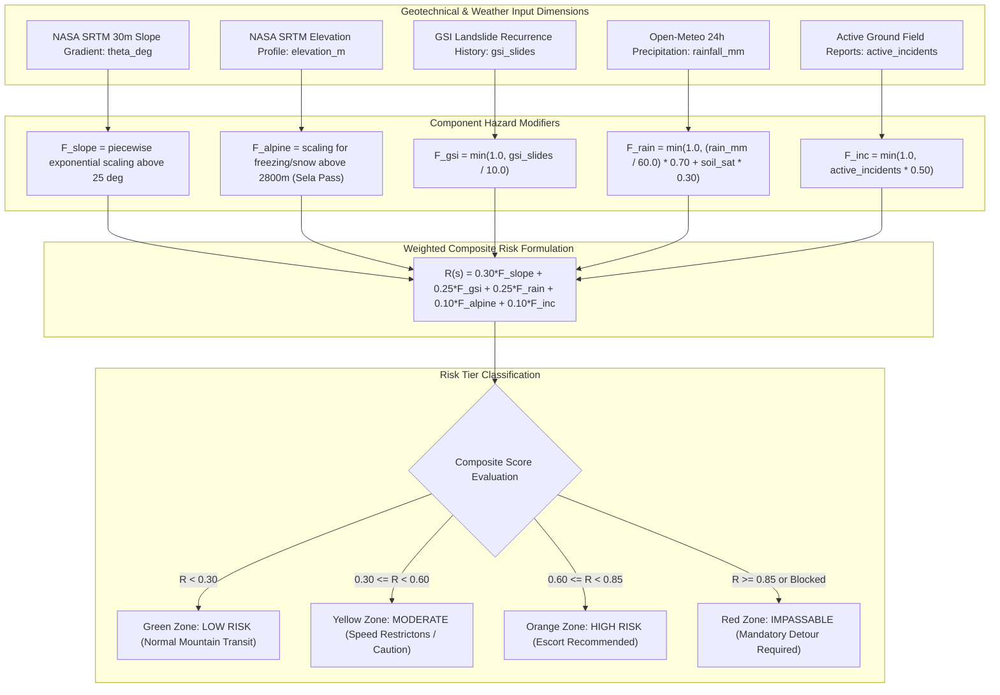
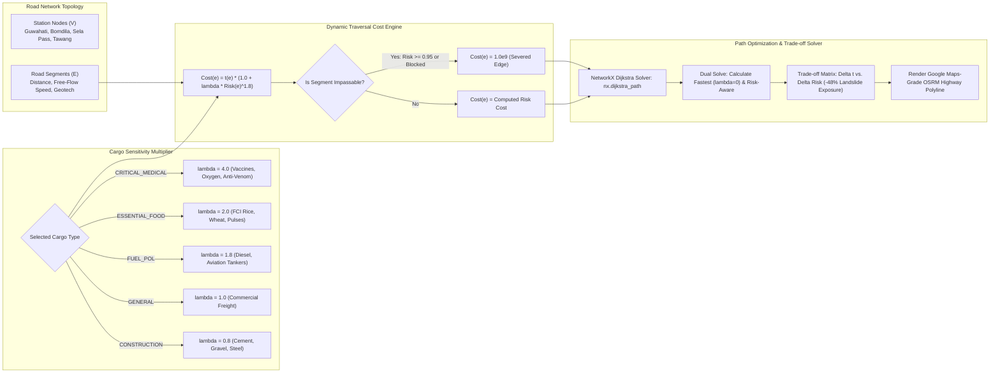
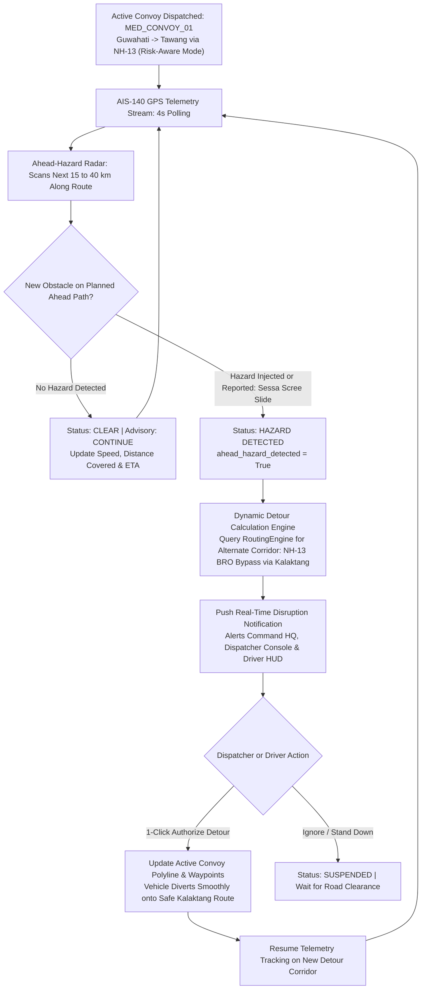

# Architecture & Workflow Diagram Reference

This document serves as the centralized, authoritative repository of all system architecture and workflow diagrams across all implementation phases of the **AI-Based Smart Logistics & Accessibility Intelligence Platform for North Eastern Region (NER)** (Smart India Hackathon Problem Statement ID: **26002** | Target Ministry: **Ministry of Development of North Eastern Region - MDoNER**).

---

## Index of Architecture Diagrams

1. [End-to-End System Platform Architecture](#1-end-to-end-system-platform-architecture)
2. [Multi-Stakeholder Workspace Isolation & Role Access](#2-multi-stakeholder-workspace-isolation--role-access)
3. [Multi-Tier Persistent API Caching & Fault-Tolerant Ingestion](#3-multi-tier-persistent-api-caching--fault-tolerant-ingestion)
4. [Dynamic Geotechnical & Weather Disruption Risk Engine](#4-dynamic-geotechnical--weather-disruption-risk-engine)
5. [Risk-Penalized Dijkstra Pathfinding & Cargo Multiplier Engine](#5-risk-penalized-dijkstra-pathfinding--cargo-multiplier-engine)
6. [Real-Time Convoy Tracking & Automated Disruption Rerouting Workflow](#6-real-time-convoy-tracking--automated-disruption-rerouting-workflow)
7. [Offline-First Field Incident Reporting & Edge Clearance Lifecycle](#7-offline-first-field-incident-reporting--edge-clearance-lifecycle)

---

## 1. End-to-End System Platform Architecture

Illustrates the complete data journey from live external sensor APIs (Open-Meteo, NASA SRTM DEM, Geological Survey of India, OpenStreetMap OSRM, data.gov.in) through the backend analytical engines to the isolated stakeholder interfaces.

---

## 2. Multi-Stakeholder Workspace Isolation & Role Access

Depicts the entry gateway, top-level workspace switcher, and role-specific viewport isolation ensuring that emergency commanders, commercial freight dispatchers, field engineers, convoy drivers, and citizens receive tailored, clutter-free interfaces.

---

## 3. Multi-Tier Persistent API Caching & Fault-Tolerant Ingestion

Shows the multi-tier caching mechanism that eliminates redundant external API network round-trips, prevents rate-limiting, and guarantees sub-2ms response latencies during mountain operations.

---

## 4. Dynamic Geotechnical & Weather Disruption Risk Engine

Details the mathematical calculation pipeline that dynamically bounds road segment traversal risk based on real-time geotechnical, meteorological, and checkpost incident stressors.

---

## 5. Risk-Penalized Dijkstra Pathfinding & Cargo Multiplier Engine

Details how road network graphs are constructed with dynamic edge impedance weighted by cargo sensitivity multipliers to guarantee safe transit for high-consequence supplies.

---

## 6. Real-Time Convoy Tracking & Automated Disruption Rerouting Workflow

Shows how active convoys carrying emergency supplies are monitored via simulated AIS-140 GPS telemetry, scanned for ahead hazards, and seamlessly rerouted around sudden landslides.

---

## 7. Offline-First Field Incident Reporting & Edge Clearance Lifecycle

Depicts how on-ground Border Roads Organisation (BRO) engineers and police checkposts log geo-tagged incident reports, snap them to mountain highway segments, and restore severed edges once cleared.

```mermaid
flowchart TD
    IncidentOccurs(["Sudden Mountain Hazard Occurs<br/>Landslide, Flash Flood, Mudflow, or Rockfall"]) --> FieldApp["Field Engineer Opens Mobile PWA: FieldOps.jsx"]

    FieldApp --> CaptureData["Capture Incident Coordinates (Map-Click or GPS)<br/>Select Category (LANDSLIDE) & Severity (BLOCKING)<br/>Attach On-Ground Photo"]

    CaptureData --> ConnCheck{"Device Telecom Signal Available?"}
    ConnCheck -->|No Signal: Alpine Dead-Zone| LocalQueue["Queue Report in Browser LocalStorage / IndexedDB<br/>Show Pending Sync Badge"]
    LocalQueue --> WaitSignal["Periodic Network Probe"]
    WaitSignal -->|Signal Restored| DispatchAPI["Dispatch POST /api/field-reports"]
    ConnCheck -->|Yes: Signal Active| DispatchAPI

    DispatchAPI --> Snapper["Haversine Road Edge Snapping Engine: field_report_service.py"]
    Snapper --> MatchSegment["Find Nearest Highway Edge within 15 km Radius<br/>Snaps to SEG_06: Tippi -> Sessa Scree Belt"]

    MatchSegment --> BlockGraph["Mutate Network Graph<br/>Set is_blocked = True | Risk = 1.0 (IMPASSABLE)<br/>Update Segment in Central Routing Engine"]

    BlockGraph --> NotifySystem["Broadcast Alert Across Platform<br/>District Matrix Turns RED | Active Convoys Trigger Detour"]

    NotifySystem --> BROClearance["BRO 42 BRTF Heavy Equipment Deployed<br/>Bulldozers & Excavators Clear Scree Debris"]

    BROClearance --> ReopenClick["Field Engineer Clicks: 'Mark Cleared / Reopen Road'"]
    ReopenClick --> RestoreGraph["Graph Edge Restored to Open Status<br/>Recalculate Baseline Risk Score<br/>Normal Corridor Logistics Resumes"]
```

