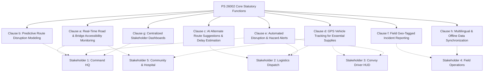
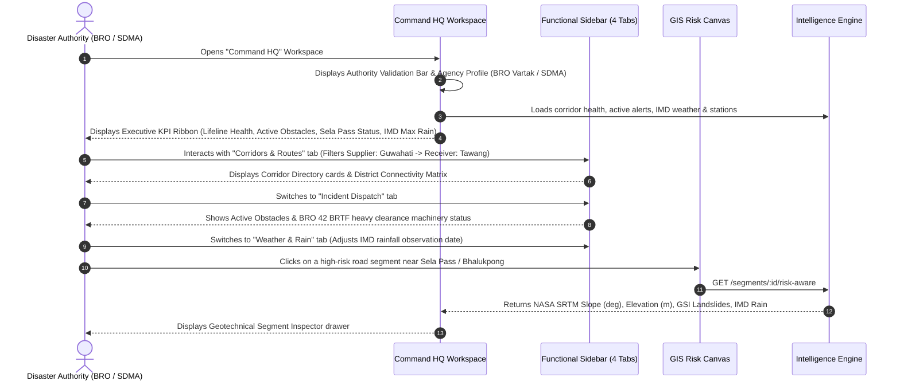
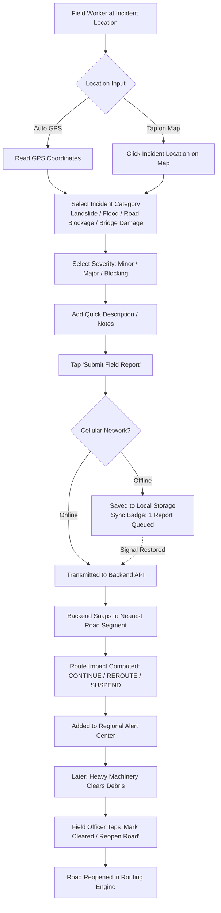

# AI-Based Smart Logistics & Accessibility Intelligence Platform for North Eastern Region (NER)
## Prototype Core Stakeholder Specification, User Flows & Interface Architecture

---

> **Document Type:** Prototype Core Architecture, Stakeholder Needs & User Flow Specification  
> **Problem Statement ID:** 26002  
> **Problem Statement Title:** AI-Based Smart Logistics and Accessibility Intelligence Platform for North Eastern Region (NER)  
> **Organization:** Ministry of Development of North Eastern Region (MDoNER)  
> **Target Corridor Baseline:** Guwahati &rarr; Tezpur &rarr; Bhalukpong &rarr; Bomdila &rarr; Dirang &rarr; Sela Pass &rarr; Tawang (NH-13 Corridor)  
> **Git Branch:** `feature/prototype-core-stakeholders-ui`  
> **Reference Baseline:** [PROBLEM_STATEMENT.md](./PROBLEM_STATEMENT.md) | Canonical Reference: [COMPREHENSIVE_PS_STAKEHOLDER_USP_ANALYSIS.md](./COMPREHENSIVE_PS_STAKEHOLDER_USP_ANALYSIS.md)  

---

## 1. Executive Summary & Prototype Scoping

The **comprehensive stakeholder analysis** ([COMPREHENSIVE_PS_STAKEHOLDER_USP_ANALYSIS.md](./COMPREHENSIVE_PS_STAKEHOLDER_USP_ANALYSIS.md)) established an exhaustive theoretical catalog of 80+ micro-requirements, academic formulas, and multi-state road networks. While valuable as a long-term reference, **building a working prototype for Smart India Hackathon requires laser focus on the core statutory capabilities of Problem Statement 26002**.

### The Core Problem Statement 26002 Mandate
The North Eastern Region (NER) suffers severe supply disruptions due to:
- Steep Himalayan slopes (>35°), fragile young sedimentary geology, and seismic vulnerability.
- Extreme monsoon precipitation (>2,500 mm to 11,000 mm) causing landslides, mudflows, and river washouts.
- Pervasive telecom dead zones (>65% of mountain highways) where mainstream apps (Google Maps, Waze) fail.
- Critical shortages of lifesaving medicines, vaccines, food grains (PDS), and fuel in isolated frontier districts like Tawang.

### Prototype Scope vs. Comprehensive Fluff
| Dimension | Comprehensive Document (78 KB) | Prototype Focus (This Document) |
|---|---|---|
| **Geographic Scope** | All 8 North Eastern States (350+ districts) | Core Arterial Lifeline: Guwahati &rarr; Tawang (NH-13 Corridor, 2,964 segments) |
| **Stakeholder Depth** | 80 granular micro-features across 6 personas | Priority Focus on **Stakeholder 1, 2, and 4**; Basic Tier for **3 and 5**; Lab for **6** |
| **Data Pipelines** | Theoretical satellite data mesh + radar telemetry | Real NASA SRTM 30m DEM slope/elevation + GSI historical landslides + IMD gridded rainfall |
| **Routing Algorithm** | Multi-state stochastic Markov decision processes | Risk-Weighted Dijkstra with Explainable Terrain, Weather & Incident Cost Penalties |
| **User Experience** | 1 monolithic screen stacking 12 competing widgets | Modern, role-tailored multi-stakeholder interface with zero clutter |

---

## 2. Statutory PS 26002 Core Functions (Clauses a &ndash; h)

Every feature in this prototype directly maps to one of the 8 statutory clauses of Problem Statement 26002:



---

## 3. Priority Stakeholder 1: Regional Command & Disaster Authorities

**Key Personas:** Chief Engineer (BRO Project Vartak / 42 BRTF); Senior Officer (Arunachal SDMA / Itanagar); Disaster Operations (Assam ASDMA / Dispur); Director (MDoNER Central / Delhi).

### 3.1 Core Needs (Pruned to PS Core Functions)
1. **Authority Identity & Role Validation (Executive Context):** Fast agency & jurisdiction verification (e.g. BRO Project Vartak covering Kameng & Tawang; ASDMA covering Assam supply bases) ensuring the command dashboard operates under appropriate authority without cumbersome login barriers.
2. **Inter-Regional Corridors (Supplier Region &rarr; Receiver Region):** Macro supply route directory tracking supply bases (Guwahati/Kamrup Metro, Silchar, Dibrugarh) to frontier receiving districts (Tawang, West Kameng, Kohima/Imphal, Tezu) across the Northeast, including the active Western Strategic Corridor (NH-13), Central Arterial, Barak Arterial, and Eastern Trans-Arunachal.
3. **District Connectivity & Health Matrix:** Instant visibility across critical border and transit districts (Tawang, West Kameng, Sonitpur, Kamrup Metro) showing status (Connected / Restricted / Severed), primary lifeline routes, and active chokepoints.
4. **Grouped Functional Sidebar (4 Operational Tabs):** Rather than cluttering the screen with unorganized widgets, functionalities are cleanly partitioned:
   - `🛣️ Corridors & Routes`: Supplier &rarr; Receiver filters, Corridor Directory cards, District Connectivity Matrix.
   - `🚨 Incident Dispatch`: Active obstacle radar, AlertCenter feed with 1-click status toggles, BRO 42 BRTF machinery readiness (Dozer/Excavator teams).
   - `🌧️ Weather & Rain`: IMD gridded daily rainfall date picker, NASA SRTM slope susceptibility, GSI historical landslide cluster zones.
   - `🏔️ Chokepoints`: Station elevation profile (Guwahati 60m to Sela Pass 3,733m), bridge weight limits, and high-altitude hazard monitoring.
5. **Interactive GIS Map Canvas & Geotechnical Inspector:** Real-time risk coloring (Green / Orange / Red) across 2,964 OSM road segments, hazard pins, and deep geotechnical inspection drawer (NASA SRTM slope, elevation, GSI landslides, IMD rain) upon clicking any road segment.

### 3.2 User Mental Model & Knowledge Level
- High-level decision maker / executive administrator.
- Needs fast situational awareness, inter-regional supply connectivity, aggregate risk metrics, and early warning indicators.
- Must know *which* corridor connects *which* supply node to *which* frontier zone, and what resources (e.g. BRO 42 BRTF) are actively deployed.

### 3.3 End-to-End User Flow



### 3.4 Page Structure & UI Layout
- **Top Authority Validation & KPI Ribbon:**
  - Active authority badge & quick-switcher modal (Agency, Officer Name, Jurisdiction).
  - High-visibility KPIs: Western Lifeline Status (🟢/🟡/🔴), Active Disruption Count, Sela Pass Alpine Status, IMD Max Daily Precipitation.
- **Left Functional Sidebar (380px, 4 Tabs):**
  - **Tab 1: 🛣️ Corridors & Routes:** Supplier/Receiver corridor filter, regional corridor cards (Western, Central, Barak, Eastern), District Connectivity Matrix.
  - **Tab 2: 🚨 Incident Dispatch:** Obstacle count, Alert Center with live hazard toggles, BRO BRTF machinery dispatch status.
  - **Tab 3: 🌧️ Weather & Rain:** IMD rainfall date picker, weather impact gauge, NASA SRTM slope thresholds, GSI landslide clusters.
  - **Tab 4: 🏔️ Chokepoints:** Station elevation ladder (60m to 3,733m), bridge load capacities, Sela Tunnel bypass status.
- **Right Main Canvas (GIS Accessibility Map):**
  - Full corridor polyline with risk color-coding (Green = Low Risk, Orange = Moderate, Red = High/Blocked).
  - Clickable road segments for deep geotechnical inspection.
  - Active hazard pins and incident badges.
  - Geotechnical Inspector drawer (SRTM Slope, Elevation, GSI Count, IMD Precipitation, Road Classification).

---

## 4. Priority Stakeholder 2: Logistics Dispatchers & Supply Depots

**Key Personas:** Logistics Dispatch Officer, Food Corporation of India (FCI); Medical Supply Officer, National Health Mission (NHM); Petroleum Distribution Officer, IOCL.

### 4.1 Core Needs (Pruned to PS Core Functions)
1. **Commodity-Priority Routing (Clause c):** Ability to prioritize routes based on cargo sensitivity (Medicines/Cold-Chain = Maximum safety, Food Grains = Balanced, Construction = Cost/distance oriented).
2. **Safe vs. Fastest Route Trade-off (Clause c):** Clear, side-by-side comparison showing additional travel time versus landslide risk reduction.
3. **Explainable Risk Breakdown (Clause b):** Clear explanation of why a route is risky (steep terrain, past slides, heavy rain).
4. **GPS Convoy Movement & ETA Tracking (Clause d):** Real-time vehicle simulation along the planned route with speed, progress, and arrival countdown.
5. **Automated Disruption Rerouting (Clauses c & e):** Instant evaluation (CONTINUE / REROUTE / SUSPEND) when a road blockage occurs while a vehicle is in transit, with 1-click detour authorization.

### 4.2 User Mental Model & Knowledge Level
- Operational supply manager focused on delivery schedules, driver safety, and cargo preservation.
- Needs clear trade-off decision support: *"Is it worth taking a 45-minute detour to bypass a high-risk landslide zone?"*
- Requires clear progress indicators and actionable disruption prompts.

### 4.3 End-to-End User Flow

```mermaid
flowchart TD
    A[Step 1: Configure Mission<br/>Origin: Guwahati Depot | Dest: Tawang PHC<br/>Cargo: Critical Medical Cold-Chain] --> B[Step 2: Calculate Route<br/>Toggle: Risk-Aware vs. Fastest]
    B --> C{Evaluate Route Comparison}
    C -->|Fastest Route| D[14h 15m | High Risk 0.68 | 3 Hazard Zones]
    C -->|Risk-Aware Route| E[15h 30m | Low Risk 0.21 | Avoids Nichiphu Cut]
    E --> F[Step 3: Dispatch Convoy<br/>Create Monitored Vehicle]
    F --> G[Live Telemetry Tracking<br/>Speed, Progress Bar, ETA Countdown]
    G --> H{Sudden Incident on Route?}
    H -- No --> I[Vehicle Arrives Safely at Destination]
    H -- Yes: Blockage Detected --> J[Automated Disruption Engine Evaluates]
    J --> K[Prompt: REROUTE RECOMMENDED<br/>Bypass via Balipara: +1.2 hrs]
    K --> L[Dispatcher Confirms Detour<br/>Vehicle Diverts to Safe Route]
```

### 4.4 Page Structure & UI Layout
- **Left Rail (Stepped Mission Planner):**
  - **Mode Toggle:** Fastest (baseline) vs. Risk-Aware (recommended).
  - **Cargo Priority Selector:** Medical Supplies, Food Grains, Fuel (POL), Construction, General.
  - **Dispatch Point & Destination:** Dropdown with corridor hubs.
  - **Calculate Route Button:** Clear primary CTA with loading state.
- **Center Canvas (Route Path Map):**
  - Primary route line rendered in vibrant blue/green.
  - Waypoint markers for Origin, Destination, and active simulated vehicle.
  - Highlighted detour bypass when rerouting.
- **Right Rail (Evaluation & Telemetry):**
  - **Decision Alert Banner:** Prominent indicator (CONTINUE / REROUTE / SUSPEND).
  - **Route Summary:** Distance (km), Travel Time (hrs/mins), Average Risk Score.
  - **Side-by-Side Route Comparison:** Fastest vs. Risk-Aware delta metrics.
  - **Explainable Risk Breakdown:** Terrain, Landslide History, and Weather factor bars.
  - **Vehicle Panel:** Live telemetry controls (Start, Pause, Reset), Speedometer, Progress gauge, and ETA timer.

---

## 5. Priority Stakeholder 4: On-Ground Field Engineers & Checkposts

**Key Personas:** Junior Engineer (JE), Border Roads Organisation (42 BRTF); Police Sub-Inspector, Bhalukpong Border Checkpost; Village Guard.

### 5.1 Core Needs (Pruned to PS Core Functions)
1. **60-Second Mobile-Friendly Incident Logging (Clause f):** One-tap or auto GPS capture, incident type selection (Landslide, Flash Flood, Road Blockage, Bridge Damaged, Tree Fall), severity rating (Minor, Major, Blocking).
2. **Automatic Road Snapping (Clause f):** Backend snaps field coordinates to the nearest OSM highway segment within 1 km.
3. **Offline Readiness & Synchronization Indicator (Clause h):** Visual indication that reports can be queued and safely synchronized when entering network dead-zones.
4. **Road Clearance & Reopening Lifecycle (Clauses a & f):** Field engineers can mark an obstacle as cleared/resolved, instantly reopening the road in the routing graph.

### 5.2 User Mental Model & Knowledge Level
- Field worker on the ground, often wearing gloves, standing in rain, mud, or poor lighting.
- Needs large touch targets, minimal typing, fast submission, and clear feedback.
- Should never see complex dispatch parameters or historical weather date selectors.

### 5.3 End-to-End User Flow



### 5.4 Page Structure & UI Layout
- **Left Rail (Mobile-First Incident Form):**
  - **Location Capture:** "Pick from Map" button or manual latitude/longitude input.
  - **Incident Type Grid:** Large cards for Landslide, Flood, Road Blockage, Bridge Damage, Tree Fall.
  - **Severity Chips:** Minor, Major, Blocking.
  - **Notes & Reporter Name:** Optional brief input.
  - **Submit Button:** High-contrast CTA with instant feedback toast.
  - **Offline Status Pill:** Displays "🟢 Offline-Ready (Local Storage Sync)".
- **Center Canvas (Incident Map):**
  - Interactive map with target crosshairs when "Pick Location" is active.
  - Geo-tagged warning pins for all active field reports.
- **Right Rail (Active Incident Management):**
  - **Live Field Reports List:** Chronological feed of active obstacles.
  - **One-Click Resolution Button:** "Mark Resolved / Road Cleared" for each incident, allowing instant road reopening.

---

## 6. Basic Prototype Tier: Stakeholder 3 (Convoy Drivers)

**Key Personas:** Heavy Commercial Truck Driver (Tata 1618 SE 10-Wheeler); Medical Oxygen Bowser Driver.

### 6.1 Core Needs (Basic Prototype Implementation)
1. **High-Contrast Heads-Up Display (HUD) (Clause d):** Oversized digital readout showing vehicle status (Driving / Paused / Arrived), speed, and route progress.
2. **Ahead Hazard Radar (Clause e):** Visual radar showing whether upcoming road segments are Clear (🟢) or Blocked (🔴).
3. **Next Landmark Milestone:** Distance and ETA to the next key station (e.g., *"Approaching Sela Pass: 18 km"*).
4. **One-Touch Emergency SOS:** Simulated emergency distress transmission for cellular dead-zones.

### 6.2 UI Blueprint: Driver HUD Component
- Rendered in a dedicated workspace tab (`Driver HUD`).
- Dark theme styling with bold typography to minimize cognitive load while driving.
- Live progress bar linked to the simulated active vehicle.
- Prominent SOS button with instant acknowledgment feedback.

---

## 7. Basic Prototype Tier: Stakeholder 5 (Remote Communities & Hospitals)

**Key Personas:** Medical Superintendent, Tawang District Hospital; Local Fair Price Ration Depot Beneficiary; Kiwi Farmer, Ziro Valley.

### 7.1 Core Needs (Basic Prototype Implementation)
1. **Public Lifeline Corridor Passability (Clauses a & g):** Plain-language status of national highway sectors (e.g., *"Guwahati &rarr; Tezpur: Open"*, *"Bhalukpong &rarr; Bomdila: Caution (Single-Lane)"*, *"Bomdila &rarr; Tawang: Clear"*).
2. **Essential Commodity Inflow Radar (Clauses d & g):** Tracking incoming essential consignments (e.g., *"Oxygen Tanker #AR-01-9234: En Route near Dirang, ETA: 18:45"*).
3. **Public Weather & Monsoon Advisory (Clause b):** Plain-language advisory warning against night travel during heavy rainfall.

### 7.2 UI Blueprint: Community & Hospital Portal Component
- Rendered in a dedicated workspace tab (`Public Portal`).
- Clean, card-based layout without GIS complexity or technical routing parameters.
- Reassures remote citizens and hospital staff with delivery transparency.

---

## 8. Evaluator / System Architect Tier: Stakeholder 6 (Simulation Lab)

**Key Personas:** SIH Hackathon Jury, Technical Evaluators, Systems Architects.

### 8.1 Core Needs (Cleanly Separated in Lab)
1. **Hazard Injection Controls:** Inject synthetic landslides, floods, or heavy rain onto specific corridor segments.
2. **Dynamic Decision Stress-Testing:** Verify that the backend accurately triggers CONTINUE, REROUTE, or SUSPEND.
3. **IMD Historical Weather Simulator:** Slide through 2023 observation dates to evaluate rainfall impact.
4. **One-Click Demo Reset:** Flush all temporary hazards, field reports, and vehicles back to the pristine baseline.

---

## 9. Consolidated Prototype Architecture & Navigation

The restructured application cleanly presents all stakeholders through a modern, role-based header navigation:

```
┌────────────────────────────────────────────────────────────────────────────────────────────────────────┐
│  [MDoNER LOGISTICS]   🛡️ Command HQ   🚚 Logistics Dispatch   📍 Field Ops   🚛 Driver HUD   🏥 Public   🧪 Lab │
└────────────────────────────────────────────────────────────────────────────────────────────────────────┘
```

| Workspace ID | Stakeholder Persona | Priority Tier | Core Components Loaded |
|---|---|:---:|---|
| `command` | Regional Command (MDoNER / SDMA / BRO) | **Tier 1 (Focus)** | `CorridorOverview`, `WeatherControls`, `AlertCenter`, `SegmentDetailPanel` |
| `dispatch` | Logistics Dispatchers (FCI / Health) | **Tier 1 (Focus)** | `RoutePlanner`, `AlertPanel`, `RouteSummary`, `RouteComparison`, `RiskBreakdown`, `VehiclePanel` |
| `field` | Field Engineers & Checkposts (BRO / Police) | **Tier 1 (Focus)** | `FieldReportPanel`, `AlertCenter` (Resolutions), Location Picker |
| `driver` | Convoy Drivers (Fleet Unions) | **Tier 2 (Basic)** | `DriverHUD`, Route Progress, Ahead Hazard Radar, SOS Trigger |
| `public` | Communities & District Hospitals | **Tier 2 (Basic)** | `PublicPortal`, District Passability Cards, Supply Inflow Tracker |
| `lab` | Evaluators & System Architects | **Tier 3 (Lab)** | `HazardControl`, `WeatherControls`, `AlertCenter`, Reset Demo Baseline |

### Zero Feature Deletion Guarantee
Every feature implemented in the codebase—including Dijkstra risk routing, SRTM elevation/slope inspection, GSI landslide counts, IMD rainfall data, field incident GPS snapping, deterministic vehicle simulation, and live disruption decisions—is preserved and organized into its logical, role-appropriate workspace.
